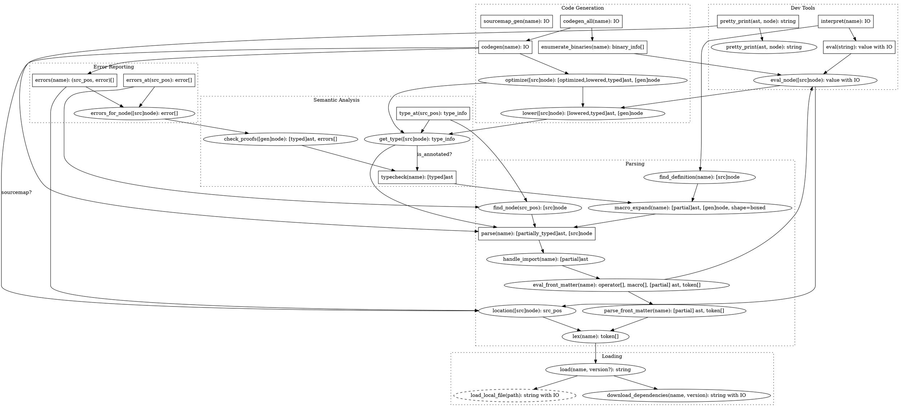

# Passes

Passes are implemented as queries.

## Raw Passes

> ### Legend
> 
> - Each square box is a user interface (commandline, web, interactive terminal, language server protocol API - like for VSCode)
> - Each box or circle is a query with parameters in parens and the result after the colon.
> - arrows are a dependency where one query should call another query
> - `T with Eff` is a value of type `T` but has some effect `Eff`
> - `T[]` is vector/list/multi-set of values of type `T` (these are intentionally left to the implementation to define)
> - Dashed circles are 'volatile' and might change without notifying anyone (so they have to be checked / watched)

## Notes

- A file update should not require **re-parsing** the contents of other files, unless:
  - A macro is updated and used in the other file.
  - An operator is updated and used in the other file.

- A file change should not require **re-type-checking** other files, unless:
  - A type is changed that is depended on in another file.
  - TODO: This requires a missing file / ast-diffing system.

- **Moving** a file/directory should not require re-parsing it
  - TODO: Names should be contextual / based on references?

- **Reordering** non-sequenced items should only require remapping `location` information into outputs.

- **Renaming** items (to an unused name) should only require remapping `name` information into outputs.
  - TODO: This is currently broken by all things used names as query keys.
  - TODO: This is in tension with the reordering principle as 

- Renaming to a name that doesn't currently exist should be a single string-interner lookup.

I also want to make re-ordering things in a file (where the order isn't a sequence) only require updating the locations of error messages and things like that...
But it is, in-practice, hard to work out how to do that... 
It'd also be nice if changing something in one file (that doesn't change the type / names of things / parsing relevant stuff) didn't require reprocessing every other file... 
That's also WIP
